# 数据库设计

## 1.需求分析

#### 管理员功能需求
- 添加、删除、修改、查询车辆信息
- 添加、删除、修改、查询用户信息
- 添加、删除、修改、查询租赁信息
- 审核用户借车请求，进行出车和回车操作

#### 用户功能需求
- 查询车辆信息
- 查看租赁信息
- 查询自己的用户信息
- 选择可借用车辆并发出借车请求

##  2.数据库表设计（主要表结构）
总概：
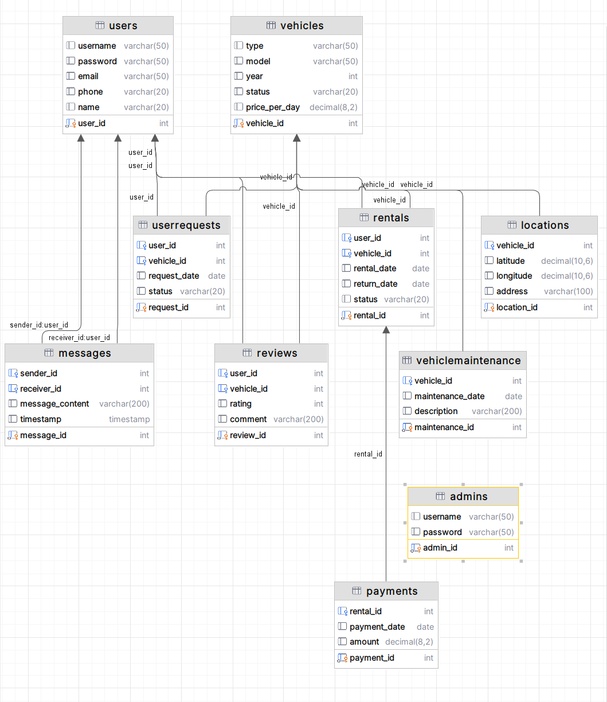
1. **Admins 表**：存储管理员信息
    - `admin_id` (主键)
    - `username`
    - `password`
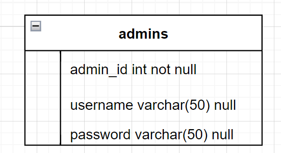
2. **Users 表**：存储用户信息
    - `user_id` (主键)
    - `username`
    - `password`
    - `email`
    - `phone`
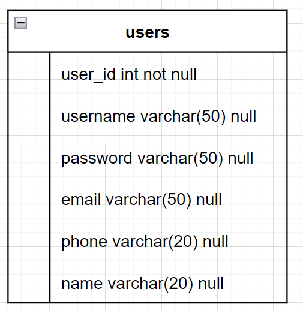
3. **UserRequests 表**：存储用户的借车请求信息
    - `request_id` (主键)
    - `user_id` (外键，关联到 Users 表)
    - `vehicle_id` (外键，关联到 Vehicles 表)
    - `request_date`
    - `status` (状态 - 待审核, 已审核, 已拒绝)
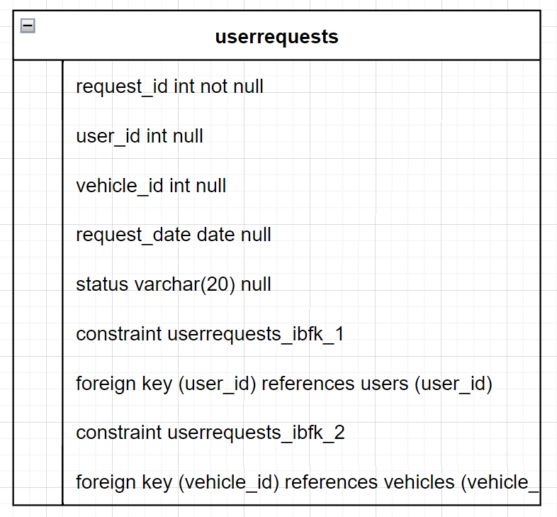
4. **Vehicles 表**：存储车辆信息
    - `vehicle_id` (主键)
    - `type`
    - `model`
    - `year`
    - `status` (状态 - 可借, 已借出, 维护中等)
    - `price_per_day`
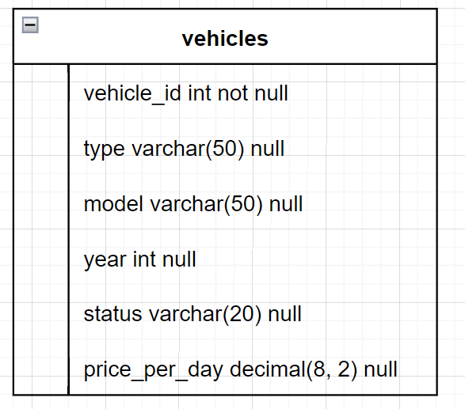
5. **Rentals 表**：存储租赁信息
    - `rental_id` (主键)
    - `user_id` (外键，关联到 Users 表)
    - `vehicle_id` (外键，关联到 Vehicles 表)
    - `rental_date`
    - `return_date`
    - `status` (状态 - 请求中, 已审核, 已借出, 已归还)
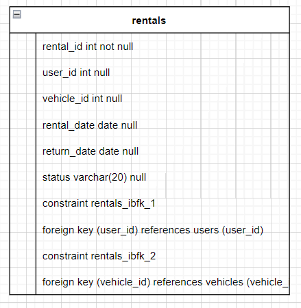
6. **VehicleMaintenance 表**：存储车辆维护信息
    - `maintenance_id` (主键)
    - `vehicle_id` (外键，关联到 Vehicles 表)
    - `maintenance_date`
    - `description`
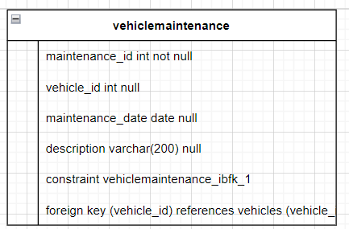
7. **Payments 表**：存储支付信息
    - `payment_id` (主键)
    - `rental_id` (外键，关联到 Rentals 表)
    - `payment_date`
    - `amount`
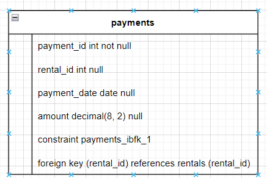
8. **Reviews 表**：存储用户对车辆的评价信息
    - `review_id` (主键)
    - `user_id` (外键，关联到 Users 表)
    - `vehicle_id` (外键，关联到 Vehicles 表)
    - `rating`
    - `comment`
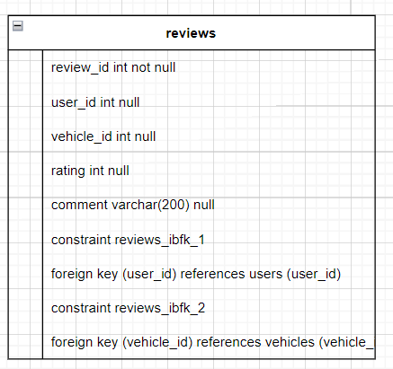
9. **Locations 表**：存储车辆位置信息
    - `location_id` (主键)
    - `vehicle_id` (外键，关联到 Vehicles 表)
    - `latitude`
    - `longitude`
    - `address`
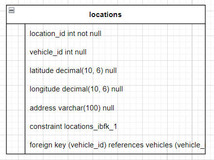
10. **Messages 表**：存储用户和管理员之间的消息通信记录
    - `message_id` (主键)
    - `sender_id` (外键，关联到 Users 表或 Admins 表)
    - `receiver_id` (外键，关联到 Users 表或 Admins 表)
    - `message_content`
    - `timestamp`
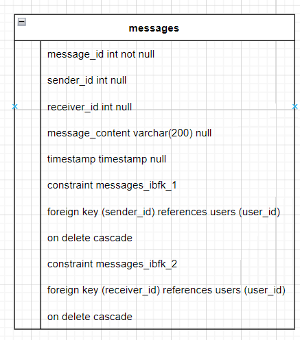
## 业务流程车辆租赁系统业务流程

1. **用户注册和登录**
   - 用户可以通过注册账号来成为系统的用户，并使用用户名和密码进行登录。

2. **车辆浏览和查询**
   - 用户可以浏览系统中所有可租赁的车辆，并根据自己的需求查询特定类型或特定条件的车辆。

3. **车辆预订**
   - 用户可以选择心仪的车辆，然后提出借车请求，包括预计的借车时间和归还时间。

4. **管理员审核**
   - 管理员收到用户的借车请求后，对请求进行审核，确认车辆是否可借出，并进行相应的处理。

5. **租赁支付**
   - 用户可以在系统中完成租赁费用的支付，包括租金和押金等。

6. **车辆取用和归还**
   - 用户在借车时间到达时取用车辆，并在归还时间前将车辆归还至指定地点。

7. **车辆维护**
   - 系统会记录车辆的维护情况，包括维护时间和维护描述，以保证车辆的正常运行状态。

8. **用户评价**
   - 用户可以对租赁的车辆进行评价，包括评分和评论，以供其他用户参考。

9. **系统消息通知**
   - 用户和管理员之间可以进行消息通信，包括借车请求的确认、支付信息的提醒等。

这些业务流程涵盖了用户、管理员以及车辆在租赁系统中的主要操作和交互过程，能够满足用户租车、管理员管理、车辆运营等方面的需求。
## E-R

# Database design

## 1. Requirements Analysis

#### Administrator Functional Requirements
- Add, delete, modify and query vehicle information
- Add, delete, modify and query user information
- Add, delete, modify and query rental information
- Review user's request for borrowing a vehicle, and carry out the operation of vehicle out and vehicle back.

#### User Functional Requirements
- Query vehicle information
- Checking rental information
- Query user information
- Select a vehicle for borrowing and send a request for borrowing the vehicle.

## 2. Database table design (main table structure)

1. **Admins table**: store administrator information
    - `admin_id` (primary key)
    - `username` (primary key)
    - `password` (primary key)
    - `name` (primary key)

2. **Users table**: stores user information
    - `user_id` (primary key)
    - `user_id` (primary key) `username`
    - `password` (primary key)
    - `name` (primary key) `username` `password`
    - `email` (primary key)
    - `phone` (primary key) `username` `password` `name` `email`

3. **UserRequests table**: stores information about the user's request to borrow a car
    - `request_id` (primary key)
    - `user_id` (foreign key, associated with Users table)
    - `vehicle_id` (foreign key, associated with the Vehicles table)
    - `request_date` (foreign key, associated with the Users table)
    - `status` (status - Pending, Reviewed, Rejected)

4. **Vehicles table**: stores vehicle information
    - `vehicle_id` (primary key)
    - `make` (primary key)
    - `model` (primary key)
    - `year` (primary key)
    - `status` (status - available, loaned, maintained, etc.)
    - `price_per_day`

5. **Rentals table**: stores rental information
    - `rental_id` (primary key)
    - `user_id` (foreign key, associated with Users table)
    - `vehicle_id` (foreign key, associated with the Vehicles table)
    - `rental_date` (foreign key, associated with the Users table)
    - `return_date` (foreign key, associated with the Users table)
    - `status` (status - requested, reviewed, loaned, returned)

6. **VehicleMaintenance table**: stores vehicle maintenance information
    - `maintenance_id` (primary key)
    - `vehicle_id` (foreign key, associated with Vehicles table)
    - `maintenance_date` (primary key)
    - `description` (primary key) `vehicle_id` (foreign key, associated with the Vehicles table)

7. **Payments table**: stores payment information
    - `payment_id` (primary key)
    - `rental_id` (foreign key, associated with the Rentals table)
    - `payment_date` (foreign key, associated with the Rentals table)
    - `amount` (foreign key, associated with the Rentals table)

8. **Reviews table**: stores information about user reviews of vehicles
    - `review_id` (primary key)
    - `user_id` (foreign key, associated with Users table)
    - `vehicle_id` (foreign key, associated with the Vehicles table)
    - `rating` (foreign key, associated with Vehicles table)
    - `comment` (foreign key, associated with the Users table)

9. **Locations table**: stores vehicle location information.
    - `location_id` (primary key)
    - `vehicle_id` (foreign key, associated with the Vehicles table)
    - `latitude` (primary key) `longitude` (foreign key, associated with the Vehicles table)
    - `longitude` (primary key) `address` (foreign key, associated with the Vehicles table)
    - `address` (primary key) `vehicle_id` (foreign key, associated with the Vehicles table)

10. **Messages table**: stores records of message communications between users and administrators
    - `message_id` (primary key)
    - `sender_id` (foreign key, associated with Users table or Admins table)
    - `receiver_id` (foreign key, associated with Users or Admins table)
    - `message_content` (foreign key, associated with Users table or Admins table)
    - `timestamp` (foreign key, associated with Users table or Admins table)

## Business Processes Vehicle Rental System Business Processes

1. **User registration and login**
   - User can become a user of the system by registering an account and logging in with a user name and password.

2. **Vehicle browsing and enquiry
   - Users can browse all the vehicles available for rental in the system and enquire about a specific type of vehicle or a vehicle with specific conditions according to their needs.

3. **Vehicle Booking**
   - Users can select the desired vehicle and then make a request to borrow the vehicle, including the expected borrowing time and return time.

4. **Administrator Review**
   - The administrator receives the user's request for a loaned vehicle, reviews the request, confirms whether the vehicle is available for loan, and handles the request accordingly.

5. **Rental Payment**
   - Users can complete the payment of leasing fees, including rent and deposit, etc. in the system.

6. **Vehicle pick-up and return**
   - Users can pick up the vehicle when the borrowing time arrives and return the vehicle to the designated location before the return time.

7. **Vehicle Maintenance**
   - The system will record the maintenance of the vehicle, including the maintenance time and maintenance description, to ensure the vehicle is in proper operating condition.

8. **User Evaluation**
   - Users can evaluate the rented vehicles, including ratings and comments for other users' reference.

9. **System Message Notification**
   - Messages can be communicated between users and administrators, including confirmation of loaned vehicle requests, reminders of payment information, and so on.

These business processes cover the main operations and interactions between users, administrators and vehicles in the rental system, and can meet the needs of users in renting vehicles, administrator management and vehicle operation.

Translated with DeepL.com (free version)